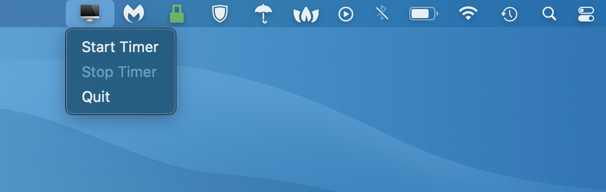

# **Pomodoro - simple app for productivity** #

## Requirements ##
1. Rumps - https://github.com/jaredks/rumps
```python 
pip install rumps
```
2. Py2app - https://py2app.readthedocs.io/en/latest/
```python 
pip install -U py2app
```


## Appearance ##



## Installation ##
```python 
python setup.py py2app
```
After installation the aplication will be in ./dist/ 
